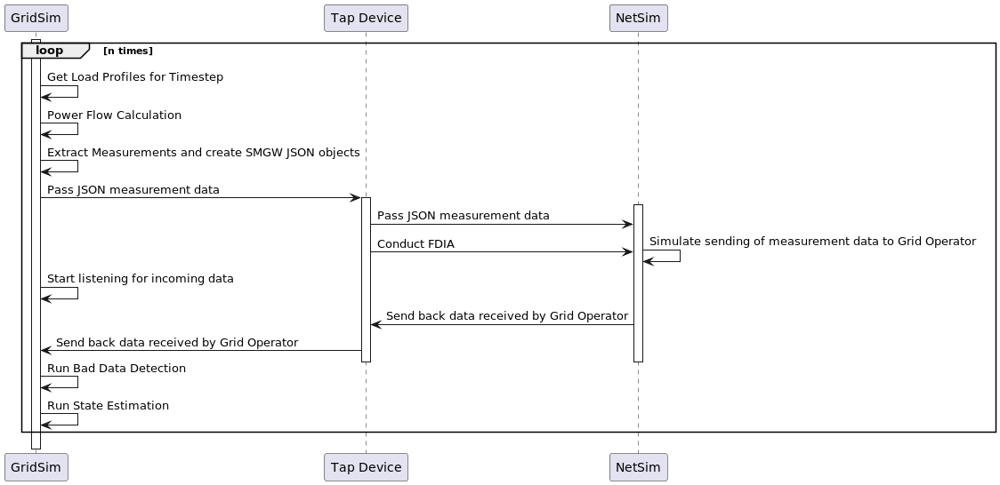

# Co-Simulation of Power Grid and Communication Network
## for the Master Thesis of Moritz Volkmann

### This Repository has to submodules that are needed for it to function: ns-3 and boost. You can download them together with the repo doing this:
```bash
git clone --recursive https://github.com/MoritzVolkman/GridComm-Cosimulation.git
```

### To get the flow right, you first need to start Netsim and then start GridSim.py

### To run the GridSim, do the following
```bash
pip install -r requirements.txt
python3 GridSim.py
```

### To run the NetSim, do the following:

1. If you already installed ns3, you should add a symlink to its directory to the ext directory like this:
```bash
ln -s PATH/TO/ns3 ext/ns3
```
If not it should (hopefully) be installed while cloning the repository and put there

2. Configure CMake Project
3. Build and run Netsim

This is how the Program should work once it is finished:



----------

### Available modes of FDIA:

- random FDIA
- random FDIA according to Liu et al. 2011
- targeted FDIA according to Liu et al. 2011 (WIP)
- Machine Learning FDIA (WIP)
- uninformed FDIA (WIP)
