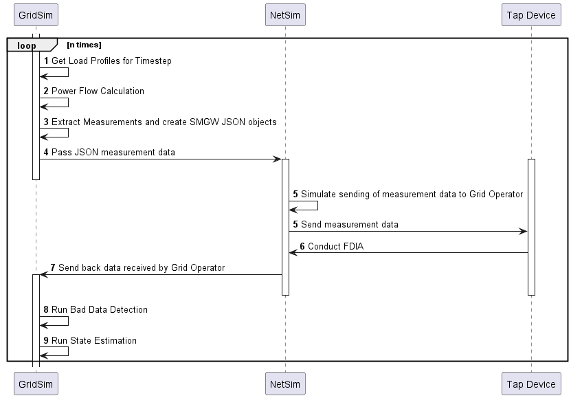

# Co-Simulation of Power Grid and Communication Network
## for the Master Thesis of Moritz Volkmann

To run the NetSim, do the following in the terminal:
```bash
~/path/to/ns3 configure --enable-python-bindings
~/path/to/ns3 build
~/path/to/ns3 shell
python ~/path/to/NetSim.py
```


