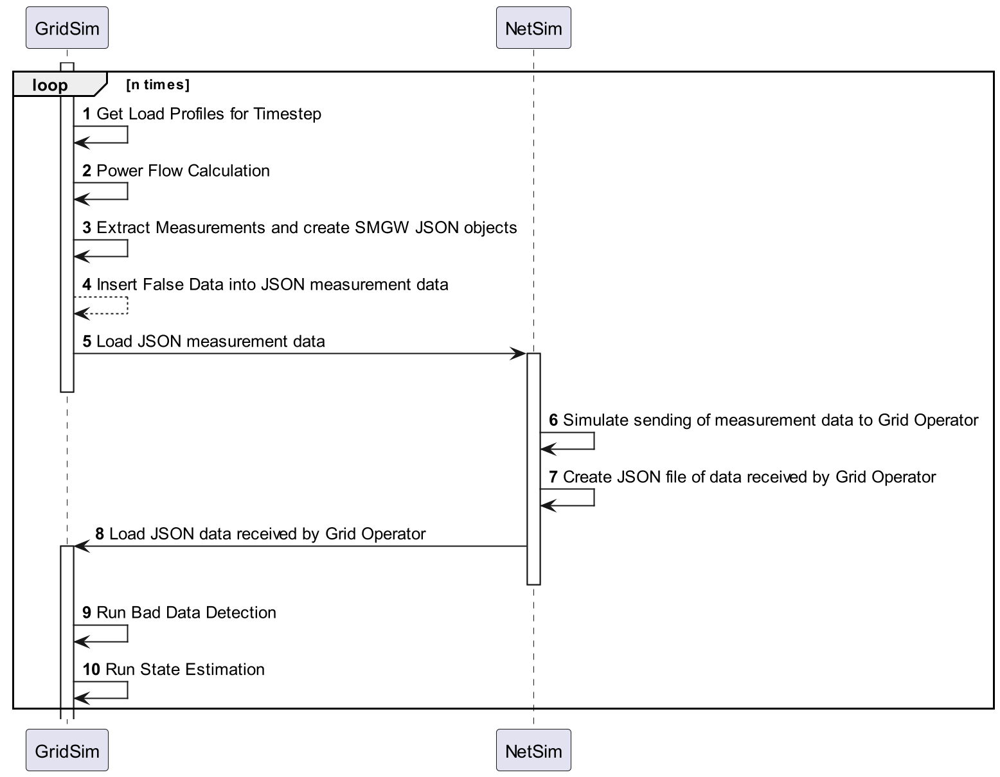
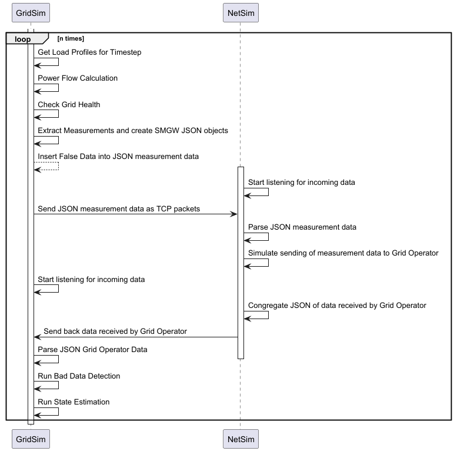

# Get Pythonenv running

Simbench requires python 3.10 or lower

```bash
python3.10 -m venv .venv 
source .venv/bin/activate # or in vs code "Select Interpreter"
pip install -r requirements.txt
```


# get C++ program running

requires C++ compiler, cmake, make or ninja
```
cmake -B build
cmake --build build
```

# cloning submodule

The ns3 software is included as a submodule to facilitate deployment and debugging. It must be cloned explicitely using

```
git submodule update --init --recursive
```

# Co-Simulation of Power Grid and Communication Network
## for the Master Thesis of Moritz Volkmann

To run the NetSim, do the following in the terminal:
```bash
cp NetSim.cc Path/to/ns3/scratch/NetSim.cc
Path/to/ns3 run scratch/NetSim.cc
```
### NetSim.py is deprecated and does not work properly, since some of the functionalities did not work in the ns-3 Python version

This is how the Program should work once it is finished:



Or like this: (not yet decided)


